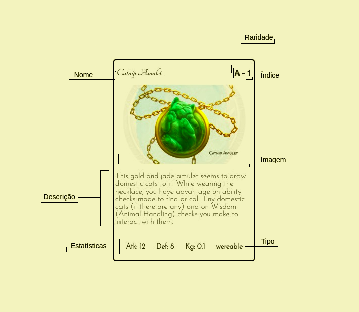

   

## Introdução:
Projeto de um gerenciador de inventário e personagem de D&D, onde os itens são representados por cartas. O objetivo é automatizar, entre outras coisas:
- O cálculo de peso carregado pelo personagem; 
- A pilhagem de corpos e recipientes; 
- Cálculo de gold;
- Cálculo de modificadores;
- Comércio;
- Monitoramento de HP;
- Monitoramento de efeitos e status do personagem;
- Uso de consumíveis;
- Items sendo usados;
- Combate

## Representação dos itens:
Todos os itens são representados por cartas, seguindo o modelo: 

